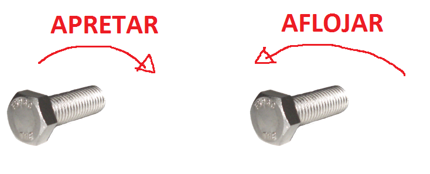

# Configuración y uso de impresoras

Calibrar base

Configuracion PrusaSlicer y Cura
Cambiar filamento

Cuidados:
* engrasarlas
* limpieja
* ajustes

##

Problemas frecuentes
## Prusa i3 

Modelos del CEP: Algunas tienes interruptor

Problema LCD
Cuidado>
* con el cristal que no se monte en las soldaduras
* con las pinzas no den el los finales de carrera

## Creality Ender 3D v2

## KingRoom KP3S