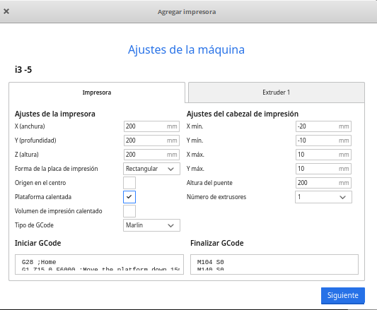

# Impresora Prusa i3

(Modelo Psyque de Createc 3D)

## Calibración

## Menús de la impresora

## Configuración de Ultimaker Cura para Prusa i3

1. En el ménu Ajustes -> Impresoras seleccionamos Agregar Impresora
1. Seleccionamos "Agregar impresora fuera de red"
1. Seleccionamos Custom 
1. Seleccionamos Custom FFF
1. Ponemos el nombre y pulsamos Agregar
1. Configuramos el tamaño de la base y la altura (normalmente 200x200x200) y marcamos "Plataforma calentada"

1. En las opciones del extrusor marcamos el diámetro del filamento y el tamaño de la boquilla (normalmente 0.4)

[Vídeo: Configuración del laminador Ultimaker Cura para impresora Prusa i3](https://youtu.be/_EcSV2h06xU)

## Cambio de filamento

1. Calentamos el extrusor hasta la temperatura correcta del filamento actual
1. Soltamos los tornillos del extrusor que hacen presión en el filmaneto (idler)
1. Empujamos un poco el filamento para que estruya un poco de plástico (y evitar que queden fragmentos) y lo sacamos con decisión.
1. Calentamos el exturor hasta la temperatura del nuevo filamento
1. Cortamos el filamento en bisel para que entre más fácilmente
1. Introducirmos el filamento manualmente hasta que vuelva a salir plástico.
1. Volvemos a poner los tornillos y ajustamos la presión.
1. Movemos la rueda del extrusor para ver que el filamento fluye.

[Vídeo: Cambio de filamento impresora Prusa i3](https://youtu.be/_YotEtusTyI)

## Varios

### Problema de atascos

1. Calentamos por encima de la temperatura normal del filamento (pero sin excedernos del límite del extrusor)
1. Liberamos el filamento
1. Empujamos con un trozo de filamento cortado plano hasta intentar liberar los restos
1. Si no se sueltan podemos apagar el ventilador durante unos segundos para que se calienten los restos de plástico
1. Si no podemos limpiarlo podemos introducir un elemento metálico pero del grosor del plástico
1. En caso de que siga sin liberarse habría que desmontar el extrusor y hacer una limpieza a fondo.

[Vídeo: Limpiando un atasco en el extrusor](https://youtu.be/T14vIGLGUKA)

### Adherencia a la placa

Podemos añadir laca al cristal de la impresora para mejorar la adherencia, no es necesario encharcarlo, basta con una cafa fina.

A medida que la vayamos usando esa capa habrá que limpiarla pues puede llegar a ensuciar la base de las piezas, sobre todo si son oscuras.

[Vídeo: Mejorando la adherencia de la base de cristal usando laca](https://youtu.be/6aUJHRHIriw)
